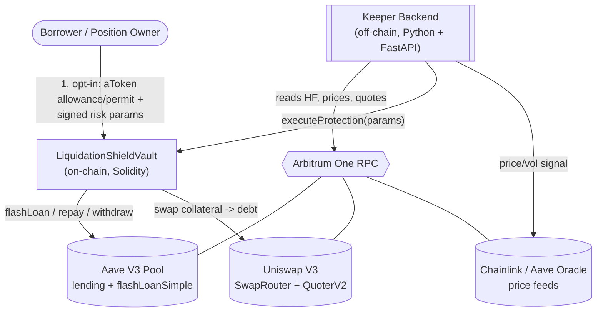
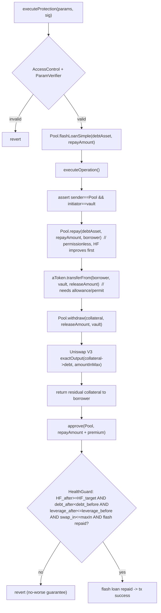
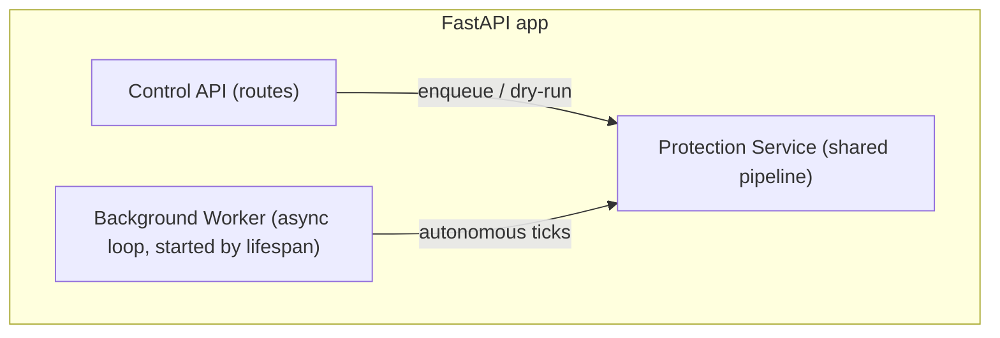
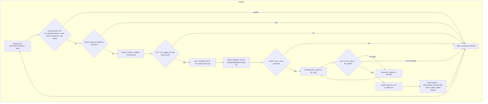
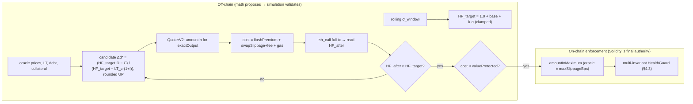
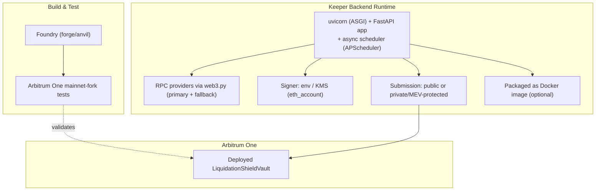
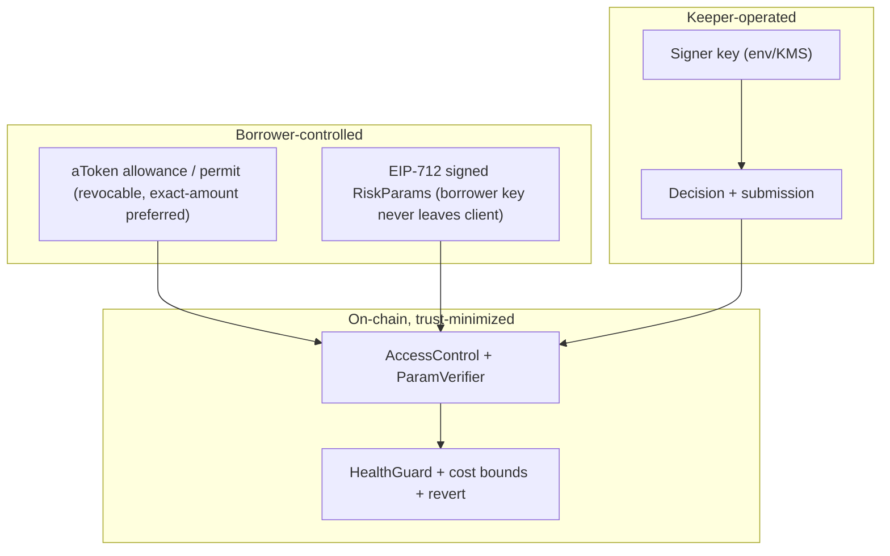

# System Architecture — Automated Liquidation Shield & Flash-Repayment Vault

| Field | Value |
|---|---|
| **System** | Automated Liquidation Shield & Flash-Repayment Vault |
| **Problem Statement** | PS-11, CSI ORIGIN 2026 |
| **Source docs** | [`Problem_Statement_11.pdf`](Problem_Statement_11.pdf), [`PRD.md`](PRD.md) |
| **Status** | Draft v1.0 · 2026-08-28 |
| **Chain** | **Arbitrum One** (chain ID 42161) |
| **Stack** | Aave V3 (lending + `flashLoanSimple`) · Uniswap V3 (swaps) · Chainlink + Aave oracle (prices) |
| **Backend** | **Python 3.11+ / FastAPI** async keeper service (via `web3.py`) |
| **Scope** | Smart contracts (Solidity) + Python/FastAPI off-chain keeper backend (no UI in v1) |

> This document translates the PRD's functional requirements (FR-1…FR-15) into a concrete, buildable architecture. Every component and flow is traced back to a requirement in §15.

---

## 1. Architectural Goals & Drivers

| Driver | Architectural implication |
|---|---|
| **Atomicity (G3)** | All restructuring effects live inside a single Aave flash-loan callback; any failure reverts the whole tx. |
| **Minimum capital (G2)** | Sizing math (`Δd*`) computed off-chain, bounded on-chain; residual collateral returned to user. |
| **Proactivity (G1, G7)** | Off-chain monitor + prediction acts at `HF_trigger` > 1.0, before liquidation. |
| **Autonomy under bounds (G6)** | User-signed risk parameters govern; keeper decides *when/how much* without per-event approval. |
| **Non-custody (G7)** | Repay is permissionless; collateral moves only via the borrower's **aToken allowance/`permit`** (`transferFrom → withdraw`, §4.3). Vault holds funds only within one tx. |
| **Economic rationality (G4)** | Viability gate (off-chain estimate + on-chain cost bounds) blocks unprofitable interventions. |

**Key quality attributes:** correctness/safety (revert guarantees), low latency (within execution window), resistance to oracle manipulation & MEV, observability, testability on fork.

---

## 2. System Context (C4 Level 1)



**Actors & externals**
- **Borrower** — opts in once (aToken allowance/`permit` + signed parameters), otherwise passive.
- **Keeper Backend** — the autonomous brain; a Python/FastAPI service that monitors, decides, and submits via `web3.py`.
- **LiquidationShieldVault** — the trust-minimized on-chain executor that owns the atomicity guarantee.
- **Aave V3 / Uniswap V3 / Chainlink** — external protocols consumed on Arbitrum One.

---

## 3. Container / Component View (C4 Level 2)

```mermaid
flowchart LR
    subgraph OFF["Off-chain Keeper Backend — Python / FastAPI service"]
        direction TB
        API["API Layer (FastAPI routes)"]
        SCHED["Scheduler (async monitor loop, APScheduler)"]
        MON["Position Monitor (web3.py)"]
        RISK["Risk / Volatility Model"]
        SIZE["Intervention Sizer (Δd*)"]
        SEL["Collateral Selector"]
        VIA["Economic-Viability Gate"]
        SIM["Tx Builder + Simulator (web3.py eth_call)"]
        SUB["Signer / Submitter (eth_account)"]
        CFG[("Config + Signed Risk Params (Pydantic)")]
        SCHED --> MON --> RISK --> SIZE --> SEL --> VIA --> SIM --> SUB
        API -. status/control .-> MON
        API -. dry-run .-> VIA
        API -. manual trigger .-> SUB
        CFG -. governs .-> SIZE
        CFG -. governs .-> VIA
        CFG -. governs .-> SUB
    end

    subgraph ON["On-chain (Arbitrum One)"]
        direction TB
        VAULT["LiquidationShieldVault"]
        FLR["FlashLoanReceiver"]
        DEBT["DebtManager"]
        COLL["CollateralManager"]
        SWAP["SwapExecutor"]
        GUARD["HealthGuard (post-conditions)"]
        AC["AccessControl + ParamVerifier"]
        VAULT --> AC
        VAULT --> FLR --> DEBT --> COLL --> SWAP --> GUARD
    end

    SUB -->|"executeProtection()"| VAULT
    DEBT -->|repay| AAVE[(Aave V3)]
    COLL -->|withdraw| AAVE
    FLR -->|flashLoanSimple| AAVE
    SWAP -->|exactOutput| UNI[(Uniswap V3)]
    MON -->|getUserAccountData| AAVE
    SEL -->|quoteExactOutput| UNI
    RISK -->|latestRoundData| ORC[(Chainlink)]
```



---

## 4. On-Chain Architecture — `LiquidationShieldVault`

### 4.1 Responsibilities
Own the **atomic** restructuring sequence and enforce all safety post-conditions. The contract is stateless between transactions (no user funds held); it acts only under the borrower's **aToken allowance/`permit`** (for collateral) and a valid signed-parameter payload.

> **One contract, logical modules.** Ship a single `LiquidationShieldVault.sol` whose "modules" below are **internal functions** (`_validateParams`, `_requestFlashLoan`, `_repayDebt`, `_withdrawCollateral`, `_executeSwap`, `_verifyHealthFactor`, `_repayFlashLoan`), not separate deployed contracts. Extract libraries later only if bytecode size demands it — logical modularity beats physical modularity for v1 (fewer interfaces, deployments, and integration failures).

### 4.1a Aave V3 permission model (must be validated before build — Sprint 0)
| Operation | Authorization | Mechanism |
|---|---|---|
| **Repay borrower debt** | none (permissionless) | `Pool.repay(debtAsset, amount, rateMode, onBehalfOf=borrower)` |
| **Withdraw borrower collateral** | borrower **aToken allowance/`permit`** | `Pool.withdraw` has no `onBehalfOf` → `aToken.transferFrom(borrower, vault, amt)` then `Pool.withdraw(collateral, amt, vault)` |

**Credit delegation is NOT used** (it authorizes borrowing, not withdrawal). `transferFrom` triggers Aave's `finalizeTransfer` health check on the borrower, so **repay must precede withdrawal** and the sequence must be atomic.

### 4.2 Interfaces
- **Implements:** `IFlashLoanSimpleReceiver` (`executeOperation`), plus `executeProtection(...)` entrypoint.
- **Consumes:** `IPool` (Aave: `flashLoanSimple`, `repay`, `withdraw`, `getUserAccountData`), `ISwapRouter` (Uniswap V3 `exactOutputSingle`/`exactOutput`), `IQuoterV2` (view, off-chain-facing), `IPoolAddressesProvider`.

### 4.3 Internal modules
| Module | Responsibility |
|---|---|
| **AccessControl + ParamVerifier** | Restrict trigger to authorized keeper or owner; verify borrower's signed risk params (EIP-712, nonce, expiry) and enforce bounds. |
| **FlashLoanReceiver** | Initiate `flashLoanSimple(debtAsset, amount)`; validate `msg.sender == pool` and `initiator == vault` inside `executeOperation`. |
| **DebtManager** (`_repayDebt`) | `Pool.repay(debtAsset, amount, rateMode, onBehalfOf=borrower)` — permissionless. |
| **CollateralManager** (`_withdrawCollateral`) | `aToken.transferFrom(borrower, vault, releaseAmount)` (needs borrower allowance/`permit`) **then** `Pool.withdraw(collateralAsset, releaseAmount, to=vault)`; return residual collateral to borrower. Runs **after** repay so the `finalizeTransfer` health check passes. |
| **SwapExecutor** (`_executeSwap`) | Uniswap V3 `exactOutput` (collateral → debt) with `amountInMaximum` bound derived from oracle price ± `maxSlippageBps`. |
| **HealthGuard** (`_verifyHealthFactor`) | Enforces the **multi-invariant no-worse guarantee**: `HF_after ≥ HF_target` **AND** `debt_after < debt_before` **AND** `leverage_after ≤ leverage_before` **AND** `swap_input ≤ amountInMaximum` **AND** flash loan fully repaid; else revert. |

### 4.4 `executeOperation` call graph


**Safety notes:** `ReentrancyGuard` on the entrypoint; strict **checks-effects-interactions**; `SafeERC20` for approvals/transfers; all external prices for HF taken from Aave/Chainlink oracle (not spot pool reserves).

---

## 5. Off-Chain Backend — FastAPI Service (Python)

The backend is a single **FastAPI** application (served by **uvicorn**, ASGI) with a clear split between a **Control API** and a **Background Worker**:



HTTP handlers **do not** run the pipeline inline: `POST /protect` hands work to the shared **Protection Service** and returns an accepted/assessment response; the **Background Worker** (launched by the `lifespan` startup hook, APScheduler / `asyncio`) drives the autonomous monitor→…→submit loop. This keeps request latency bounded and the autonomous loop authoritative. All chain I/O goes through **`web3.py`** (`AsyncWeb3`); signing uses **`eth_account`**; models/config use **Pydantic v2** (`pydantic-settings`).

**FastAPI endpoints**

| Method + path | Purpose |
|---|---|
| `GET /health` | Liveness probe. |
| `GET /positions/{borrower}` | Current HF + collateral/debt snapshot + risk verdict. |
| `GET /positions/{borrower}/assessment` | Dry-run: sizing `Δd*`, dynamic `HF_target`, selected collateral, viability verdict (no submit). |
| `POST /positions/{borrower}/protect` | Manual/forced intervention trigger — still bounded by the borrower's signed params. |
| `GET` / `PUT /config` | Read / update monitor + risk parameters (bounded, authed). |
| `GET /metrics` | Observability counters / decision metrics. |

**Autonomous decision pipeline (async monitor loop)**



| Module (Python) | Libraries / data sources | Notes |
|---|---|---|
| **Monitor** | `web3.py` `AsyncWeb3` → `Pool.getUserAccountData`, Chainlink `latestRoundData` | Async poll loop (APScheduler) + interval fallback; reconnects on RPC drop. |
| **Risk / Volatility Model** | numpy/pandas over price history, feed updates | Estimates σ over execution window → breach probability. |
| **Intervention Sizer** | oracle prices, LT per asset | Computes **candidate** `Δd*` (PRD §7), rounds UP; the simulator confirms/bumps it — math proposes, simulation validates, Solidity enforces. |
| **Collateral Selector** | `web3.py` → `QuoterV2`, LT, balances | Picks collateral minimizing total cost + best resulting HF (FR-5). **v1 primary path: single WETH → USDC**; selector generalizes after that works. |
| **Viability Gate** | quotes, gas oracle | Blocks if `cost ≥ valueProtected` (PRD §8). |
| **Tx Builder + Simulator** | `web3.py` `eth_call` (Tenderly optional) | Dry-run the exact tx; if `HF_after < HF_target`, bump `Δd*` and re-simulate before spending gas. |
| **Signer / Submitter** | `eth_account`; signer key (env/KMS) | Submits via `web3.py` (borrower's EIP-712 signature is client-supplied), optionally via private/MEV-protected relay. |
| **In-flight Lock** (FR-16) | per-borrower state | Sets `in_flight` on submit; blocks new rescues until the receipt resolves; guarantees idempotency (one rescue at a time per borrower). |
| **Circuit Breaker** (FR-17) | failure counter, health signals | Pauses autonomous submission after N consecutive failures (default 3) or on stale oracle / inconsistent RPC / invalid quote / gas spike; requires operator reset. |
| **API Layer** | FastAPI routers + Pydantic schemas | Control/observability endpoints (above); calls the shared Protection Service, never runs the loop inline. |

**Key handling & separation:** the **borrower's key never reaches the backend** (borrower signs `RiskParams`/`permit` client-side). The **keeper key only triggers** and is powerless outside the signed bounds; it is never in source, loaded from env/KMS (via `pydantic-settings`).

---

## 6. End-to-End Sequence (with revert path)

```mermaid
sequenceDiagram
    autonumber
    participant K as FastAPI Backend (Python)
    participant V as LiquidationShieldVault
    participant A as Aave V3 Pool
    participant U as Uniswap V3
    participant O as Oracle

    K->>A: getUserAccountData(borrower)
    K->>O: latestRoundData()
    Note over K: HF <= HF_trigger -> size Δd*, select collateral, check viability
    K->>K: simulate full tx (web3.py eth_call)
    alt simulation fails or non-viable
        K-->>K: decline, keep monitoring (no gas spent on-chain)
    else proceed
        K->>V: executeProtection(params, sig)
        V->>V: verify sig + bounds (EIP-712)
        V->>A: flashLoanSimple(debtAsset, repayAmount)
        A-->>V: executeOperation(...)
        V->>A: repay(debtAsset, repayAmount, borrower)
        V->>A: withdraw(collateral, releaseAmount, vault)
        V->>U: exactOutput(collateral -> debt, amountInMax)
        alt swap within slippage & HF restored
            U-->>V: debtAsset out; residual collateral -> borrower
            V->>A: approve + repay flashLoan (amount + premium)
            V->>A: assert HF_after >= HF_target
            V-->>K: success (position restored)
        else slippage exceeded OR HF_after < HF_target
            V-->>V: revert (state unchanged, no-worse guarantee)
            V-->>K: tx reverted (only keeper gas lost)
        end
    end
```

---

## 7. Position State Machine

The backend makes these states **explicit** (idempotency + no duplicate rescues, FR-16):

```python
class PositionState(str, Enum):
    HEALTHY   = "healthy"      # HF comfortable
    WATCH     = "watch"        # HF <= HF_trigger, reassessing
    ASSESSING = "assessing"    # sizing + selection + viability + simulation
    DECLINED  = "declined"     # not viable / no liquidity (transient)
    READY     = "ready"        # simulated OK, about to submit
    SUBMITTED = "submitted"    # tx broadcast, in_flight lock held, awaiting receipt
    RESTORED  = "restored"     # HF_after >= HF_target
    REVERTED  = "reverted"     # atomic revert, position unchanged
```



```mermaid
stateDiagram-v2
    [*] --> Healthy: opt-in (aToken allowance/permit + signed params)
    Healthy --> Watch: HF <= HF_trigger (buffer)
    Watch --> Healthy: price recovers
    Watch --> Assessing: evaluate
    Assessing --> Declined: not viable / no liquidity
    Declined --> Watch: conditions change
    Assessing --> Watch: HF recovered mid-assessment
    Assessing --> Ready: viable + simulation OK
    Ready --> Submitted: submit (set in_flight)
    Submitted --> Restored: receipt OK, HF_after >= HF_target
    Submitted --> Reverted: receipt reverted (atomic, unchanged)
    Reverted --> Watch: clear in_flight; retry on next signal
    Restored --> Healthy: clear in_flight; resume monitoring
    Healthy --> [*]: user revokes allowance
```

> While in `SUBMITTED`, the **in-flight lock** prevents any new rescue for that borrower until the receipt resolves; repeated `REVERTED` outcomes feed the **circuit breaker** (FR-17).

---

## 8. Data Model & Interfaces

The **on-chain ABI** (Solidity) is the contract; the **Python backend** mirrors it with Pydantic models and calls it via `web3.py`.

**Signed risk parameters (EIP-712, borrower-signed) — on-chain struct:**
```solidity
struct RiskParams {
    address borrower;
    uint256 hfTriggerBps;      // e.g. 11500 = 1.15  (when to act)
    uint256 hfTargetBaseBps;   // base target, e.g. 12500 = 1.25
    uint256 volCoeffK;         // dynamic-buffer coefficient
    uint256 hfTargetMaxBps;    // clamp
    uint16  maxSlippageBps;    // swap slippage bound
    uint16  maxCostBps;        // total intervention cost bound
    address[] allowedCollaterals;
    uint256 nonce;
    uint256 deadline;
}
```

**Entrypoint & execution params:**
```solidity
function executeProtection(
    RiskParams calldata p,
    bytes calldata sig,          // borrower signature over p
    address debtAsset,
    uint256 repayAmount,         // = Δd* (+epsilon), keeper-computed
    address collateralAsset,     // selected collateral
    uint256 amountInMaximum,     // oracle-bounded swap input cap
    uint24  uniFeeTier
) external;                       // callable by authorized keeper or borrower
```

**Backend mirror (Pydantic v2) + FastAPI schemas:**
```python
class RiskParams(BaseModel):              # mirrors the Solidity struct, ABI-encoded via web3.py
    borrower: str
    hf_trigger_bps: int                   # 11500 = 1.15
    hf_target_base_bps: int               # 12500 = 1.25
    vol_coeff_k: int
    hf_target_max_bps: int
    max_slippage_bps: int
    max_cost_bps: int
    allowed_collaterals: list[str]
    nonce: int
    deadline: int

class ProtectRequest(BaseModel):          # POST /positions/{borrower}/protect body
    params: RiskParams
    signature: str                        # borrower EIP-712 signature (hex)

class AssessmentResponse(BaseModel):      # GET .../assessment
    hf: float; hf_target: float
    repay_amount: int; collateral_asset: str
    est_cost_bps: int; viable: bool; reason: str | None = None
```

**Events (observability):**
`ProtectionExecuted(borrower, debtAsset, repayAmount, collateralAsset, hfBefore, hfAfter, costBps)` · `ProtectionDeclined(borrower, reason)` · `ProtectionReverted(borrower, reason)` — decoded by the backend via `web3.py` and surfaced through `/metrics`.

**Opt-in precondition (borrower, one-time per collateral):** an **aToken allowance** — `aToken.approve(vault, amount)` or an EIP-2612 **`permit`** (preferred: exact-amount + expiring, signed client-side) — so the vault can `transferFrom → withdraw` (§4.1a). Debt repayment needs no grant. The backend checks this allowance before assessing; without it the collateral step reverts (FR-15).

**Off-chain config (`config/arbitrum.py` / `settings.py`, `pydantic-settings` + `.env`):** pinned addresses (Aave `PoolAddressesProvider`/`Pool`, Uniswap `SwapRouter`/`QuoterV2`, Chainlink feeds), RPC endpoints, poll interval, gas policy, breaker thresholds, signer source.

---

## 9. Sizing & Viability Computation Flow (compute off-chain, enforce on-chain)



The keeper computes `Δd*` and the dynamic `HF_target`; the contract independently **enforces** the resulting guards, so a stale or manipulated off-chain input cannot force a bad execution (defense in depth).

---

## 10. Deployment & Environments



- **Contracts:** Solidity ^0.8.x, OpenZeppelin, deployed to Arbitrum One; addresses pinned in config.
- **Testing:** Foundry mainnet-fork against live Aave V3 / Uniswap V3 state; scenario harness drives a position toward liquidation (PRD §15 demo).
- **Backend:** long-running Python **FastAPI**/uvicorn service (optionally containerized) with `web3.py` RPC failover and an idempotent async decision loop; exposes the control/observability API.

**Networks & environments (explicit):**

| Environment | Network | Cost | Role |
|---|---|---|---|
| **Dev + integration + demo** | **Arbitrum One mainnet fork** (`anvil --fork-url`) | Free | **Primary.** Real Aave/Uniswap/Chainlink state, funded test accounts, oracle manipulation for the demo. All `forge` and `pytest` run here. |
| Optional live address | Arbitrum **Sepolia** | Free (faucet) | Only if a deployed contract address is required. ⚠️ **Testnet has no real DEX/flash-loan liquidity**, so it cannot exercise the swap/viability path — keep the real rescue demo on the fork. |
| Production | Arbitrum One (real) | Real ETH | Final deployment only; not needed for the hackathon. |

---

## 11. Security Architecture



| Threat | Mitigation |
|---|---|
| Vault custody risk | Non-custodial: repay is permissionless, collateral moves only via borrower allowance; holds funds one tx; residual returned. |
| aToken allowance abuse | Allowance is the trust anchor → immutable/audited vault; code pulls only the minimum inside a valid signed-params tx; prefer exact-amount expiring `permit` over infinite approval. |
| Unauthorized trigger | AccessControl + EIP-712 signed params (nonce, deadline). |
| Oracle manipulation | HF from Aave/Chainlink oracle; swap bounded by oracle-derived `amountInMaximum`. |
| MEV / sandwich | `exactOutput` fixes output; slippage cap; optional private submission. |
| Reentrancy | `nonReentrant`, CEI, `executeOperation` sender/initiator checks. |
| Partial/worse restructuring | Multi-invariant HealthGuard → atomic revert on any failure (FR-8, FR-9, FR-14). |
| Key compromise | Borrower key never on backend; keeper key only *triggers* within borrower-signed bounds — cannot exceed params or drain funds. |
| Duplicate / runaway rescues | In-flight lock (FR-16) + circuit breaker (FR-17) stop double-submits and repeated failing txs. |

---

## 12. Cross-Cutting Concerns (NFRs)

- **Observability:** structured logs + on-chain events for every decision (risk, `Δd*`, selected collateral, viability verdict, tx hash / revert reason). (NFR-5)
- **Latency:** monitor→submit within the execution window; Arbitrum's sub-second blocks give margin. (NFR-1)
- **Gas budget:** protection tx gas ≪ value protected for realistic positions. (NFR-2)
- **Reliability/idempotency:** RPC reconnect, missed intervals non-corrupting, decisions idempotent. (NFR-3)
- **Testability:** all FRs covered by fork tests incl. revert negative-control. (NFR-4)
- **Security posture:** no plaintext keys; slither/basic audit in CI. (NFR-6)

---

## 13. Technology Decisions

| Concern | Choice | Rationale |
|---|---|---|
| Network | Arbitrum One | Low latency/fees widen the execution window; PS/PRD target. |
| Lending | Aave V3 `Pool` | HF via `getUserAccountData`, multi-collateral, native flash loans. |
| Flash liquidity | Aave `flashLoanSimple` | Same protocol as debt; 0.05% premium; single integration. |
| Swap | Uniswap V3 `exactOutput` + `QuoterV2` | Produces exact debt amount; deep Arbitrum liquidity; on-chain input cap. |
| Prices | Chainlink + Aave oracle | Manipulation-resistant HF and swap bounds. |
| Contracts (on-chain) | Solidity + OpenZeppelin | `ReentrancyGuard`, `SafeERC20`, access control. |
| Contract test | Foundry fork | Realistic end-to-end validation against live state. |
| Backend | **Python + FastAPI + `web3.py`** | `asyncio` non-blocking monitor/submit; Pydantic validation; first-class REST/observability API; single backend language; `web3.py` for Aave/Uniswap/Chainlink calls, `eth_account` for EIP-712 signing. |
| Backend test | `pytest` (unit + fork-integration) | Validates sizing, viability, and submission logic against forked Arbitrum state. |

---

## 14. Open Items (architecture-affecting)

- **OA-1** — v1 primary path is **single collateral WETH → single debt USDC**; multi-collateral selection (FR-5) and multi-debt netting are follow-ups (affect CollateralManager/DebtManager + sizing).
- **OA-2** — v1 uses a **single authorized keeper**; a permissionless incentivized keeper set would add an incentive/anti-grief layer (affects AccessControl).
- **OA-3** — Protocol-agnostic lending adapter (Aave-first) is deferred; today the vault binds directly to Aave V3 interfaces.
- **OA-4** — v1 volatility model is a **rolling standard deviation** feeding `HF_target`; no ML. Sufficient to demonstrate the dynamic safety buffer (low σ → 1.25, high σ → 1.40).
- **OA-5** — **Aave permission behavior must be proven on-fork (Sprint 0)** before the production vault: repay-on-behalf + `transferFrom → withdraw`, repay-before-withdraw ordering, and the `finalizeTransfer` health check.

---

## 15. Traceability — Architecture ↔ PRD Requirements

| PRD requirement | Where realized in this architecture |
|---|---|
| FR-1 Continuous monitoring | §5 Monitor; §2/§3 context |
| FR-2 Risk prediction | §5 Risk/Volatility Model; §6 pre-submit |
| FR-3 Min-effective sizing | §9 `Δd*`; §5 Intervention Sizer |
| FR-4 Collateral amount/source | §4.1a permission model; §4 CollateralManager (`transferFrom → withdraw`); §9 |
| FR-5 Collateral selection | §5 Collateral Selector |
| FR-6 DEX liquidity/slippage | §5 Selector + §4 SwapExecutor `amountInMaximum` |
| FR-7 Flash sourcing & cost | §4 FlashLoanReceiver; §9 cost model |
| FR-8 Atomic execution | §4.4 call graph; §6 sequence |
| FR-9 Revert / no-worse | §4 HealthGuard; §6 revert path; §7 Reverted state |
| FR-10 Dynamic safety buffer | §9 `HF_target` model |
| FR-11 Economic-viability gate | §5 Viability Gate; §9 |
| FR-12 Proactive action | §5 `HF_trigger`; §7 Watch state |
| FR-13 Autonomous bounded authority | §8 RiskParams; §11 boundaries |
| FR-14 Self-safety | §4.3 multi-invariant HealthGuard; §11 threat table |
| FR-15 Authorization / opt-in | §4.1a aToken allowance/`permit` + §8 signature; §11 |
| FR-16 In-flight lock & idempotency | §5 In-flight Lock; §7 SUBMITTED state |
| FR-17 Circuit breaker | §5 Circuit Breaker; §5 pipeline gate; §11 threat table |

---

*End of System Architecture — Automated Liquidation Shield & Flash-Repayment Vault (PS-11, CSI ORIGIN 2026) — Arbitrum One / Aave V3 / Uniswap V3.*
