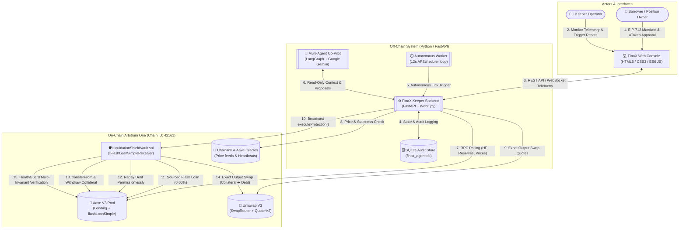
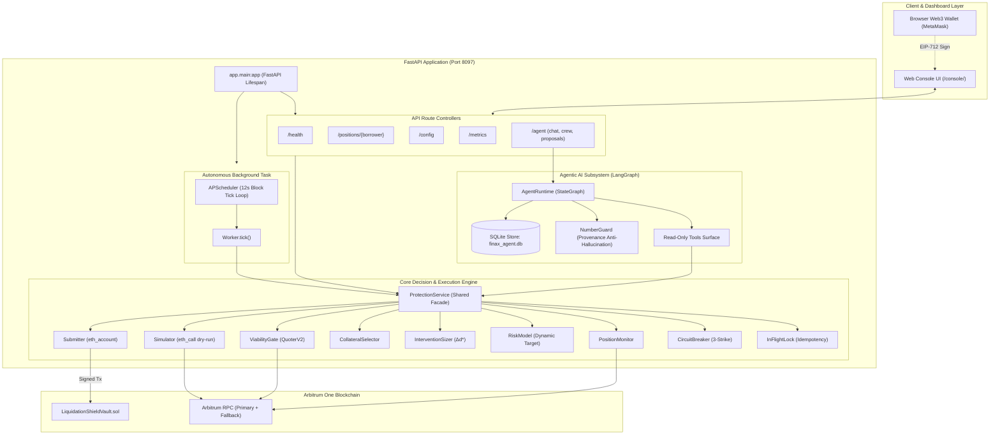
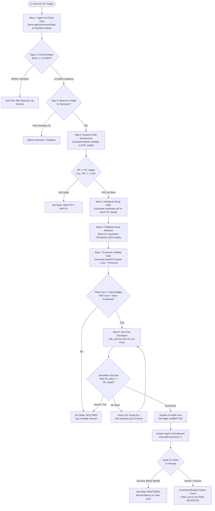
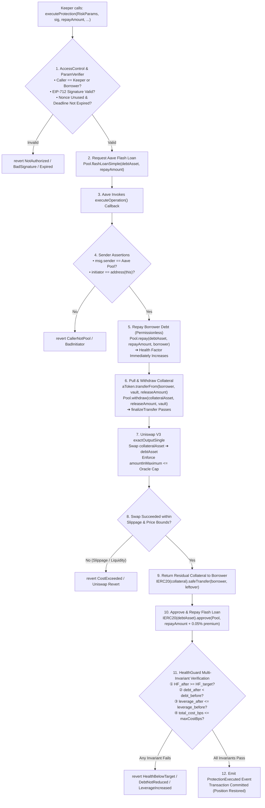
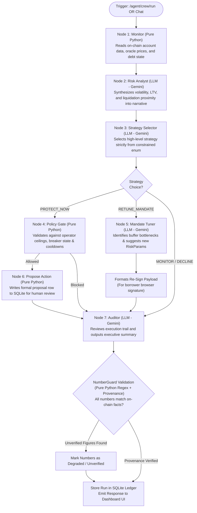
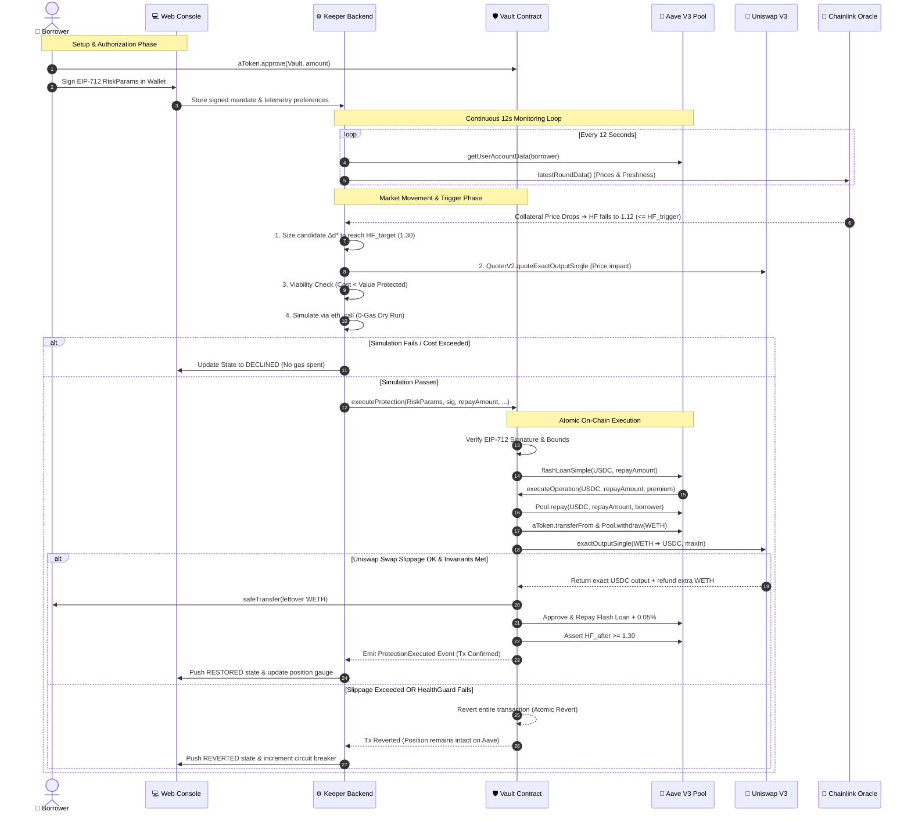
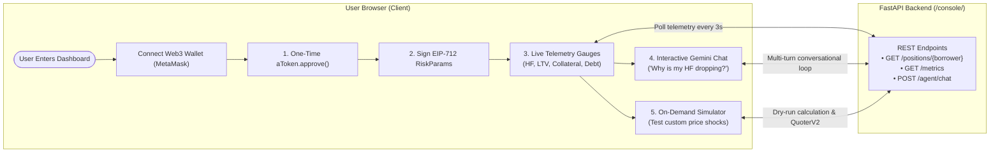

# System Architecture — FinaX Automated Liquidation Shield & Flash-Repayment Vault

| Field | Value |
|---|---|
| **System** | **FinaX** — Automated Liquidation Shield & Flash-Repayment Vault |
| **Problem Statement** | PS-11, CSI ORIGIN 2026 |
| **Source docs** | [`Problem_Statement_11.pdf`](Problem_Statement_11.pdf) · [`PRD.md`](PRD.md) · [`IMPLEMENTATION_PLAN.md`](IMPLEMENTATION_PLAN.md) |
| **Status** | Complete v1.0 (Full-Stack Architecture) |
| **Chain** | **Arbitrum One** (Chain ID `42161`) |
| **Smart Contracts** | Solidity `0.8.24` (EVM: `Cancun`), OpenZeppelin v5, Foundry |
| **Backend Engine** | Python 3.11+, FastAPI, `web3.py`, APScheduler, Pydantic v2 |
| **AI Co-Pilot** | Google Gemini (`gemini-3-flash`), LangGraph, SQLite |
| **Frontend Console** | Vanilla HTML5 / CSS3 / ES6 JavaScript (Mounted at `/console/`) |

---

## 1. System Context & External Interfaces (C4 Level 1 Flow Diagram)

The following flow diagram illustrates how borrowers, the off-chain keeper engine, the multi-agent AI layer, the on-chain vault, and external DeFi protocols interact on **Arbitrum One**.

---

## 2. Container & Service Architecture (C4 Level 2 Flow Diagram)

The backend cleanly separates the **Control API**, the **Autonomous Background Worker**, the **Shared Protection Service**, and the **Multi-Agent AI Runtime**:

---

## 3. The 8-Step Decision Engine Flowchart (Off-Chain Pipeline)

Every 12-second block tick (or on manual assessment), the system evaluates positions through an 8-step deterministic decision tree:

---

## 4. On-Chain Atomic Execution Flowchart (`executeOperation`)

All actions on-chain execute inside **Aave's `flashLoanSimple` callback within a single transaction**. If any invariant check fails, the transaction reverts completely, guaranteeing **zero capital loss**:

---

## 5. LangGraph Multi-Agent Co-Pilot State Flowchart

The AI Agent subsystem provides natural language explanations and parameter tuning recommendations. It operates on a **strict unidirectional state graph** with **zero execution privileges**:

---

## 6. End-to-End Sequence Diagram (Full Lifecycle & Reverts)

---

## 7. Position Lifecycle State Machine

The backend enforces an explicit finite-state machine with concurrency locks:

```mermaid
stateDiagram-v2
    [*] --> HEALTHY: Borrower grants aToken approval & signs RiskParams
    
    HEALTHY --> WATCH: HF <= HF_trigger + buffer (Approaching risk)
    WATCH --> HEALTHY: Collateral price rebounds
    
    WATCH --> ASSESSING: HF <= HF_trigger (Intervention triggered)
    
    ASSESSING --> DECLINED: Unviable / high slippage / no liquidity
    DECLINED --> WATCH: Market conditions change
    
    ASSESSING --> READY: Viability gate & eth_call simulation succeed
    
    READY --> SUBMITTED: Broadcast tx (In-Flight Lock acquired)
    
    SUBMITTED --> RESTORED: Receipt confirmed, HF_after >= HF_target
    SUBMITTED --> REVERTED: Tx reverted on-chain (Atomic revert)
    
    RESTORED --> HEALTHY: Clear In-Flight Lock; resume monitoring
    REVERTED --> WATCH: Clear In-Flight Lock; update circuit breaker
    
    HEALTHY --> [*]: Borrower revokes aToken approval
```

---

## 8. Frontend Web Console & User Interaction Flowchart

---

## 9. Mathematical Formulation & Invariant Summary

### 1. Minimal Sizing Formula ($\Delta d^*$)
$$\Delta d^* = \frac{\text{HF}_{\text{target}} \cdot D - C}{\text{HF}_{\text{target}} - \text{LT}_c \cdot (1 + f)}$$

* $D$: Total Debt in base currency ($\sum \text{debt}_j \times \text{price}_j$)
* $C$: Risk-weighted Collateral ($\sum \text{collateral}_i \times \text{price}_i \times \text{LT}_i$)
* $\text{LT}_c$: Liquidation threshold of the chosen collateral asset
* $f$: Fee bundle ($\text{Flash Premium (0.05\%)} + \text{DEX Fee} + \text{Slippage Buffer}$)

### 2. On-Chain HealthGuard Multi-Invariants
Every rescue must satisfy all 4 conditions before transaction completion:
1. $\text{HF}_{\text{after}} \ge \text{HF}_{\text{target}}$
2. $\text{Debt}_{\text{after}} < \text{Debt}_{\text{before}}$
3. $\text{Leverage}_{\text{after}} \le \text{Leverage}_{\text{before}}$
4. $\text{Cost}_{\text{actual}} \le \text{MaxCostBps}$

---

*End of System Architecture — FinaX Automated Liquidation Shield & Flash-Repayment Vault (PS-11).*
